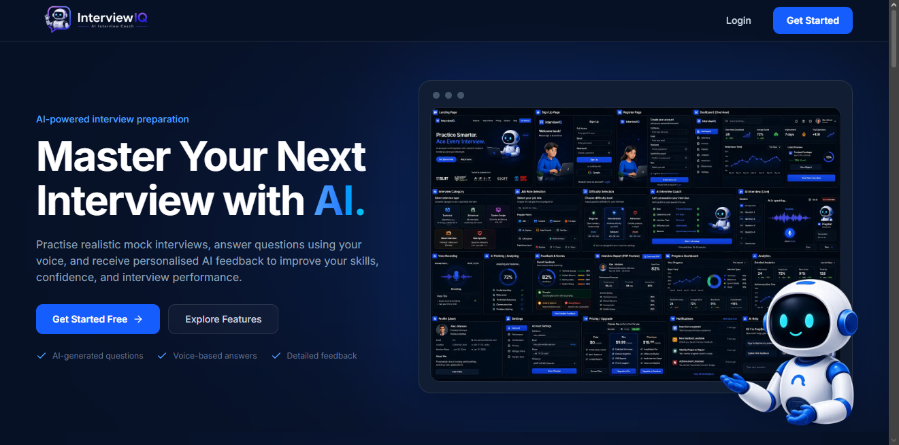
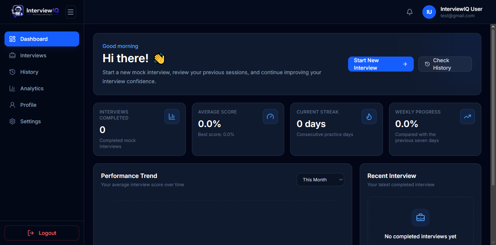
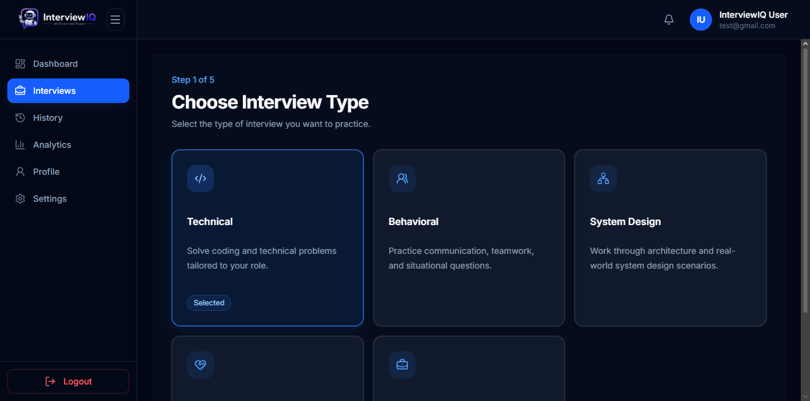
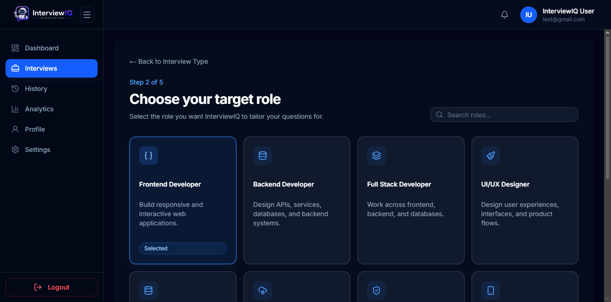
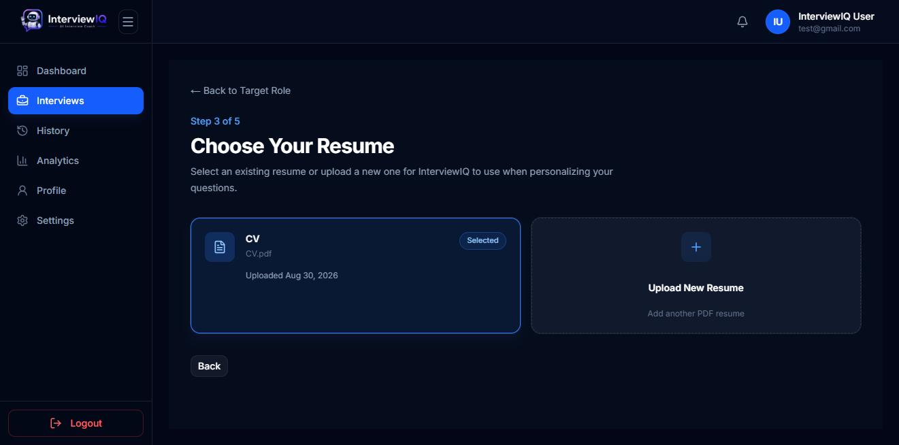
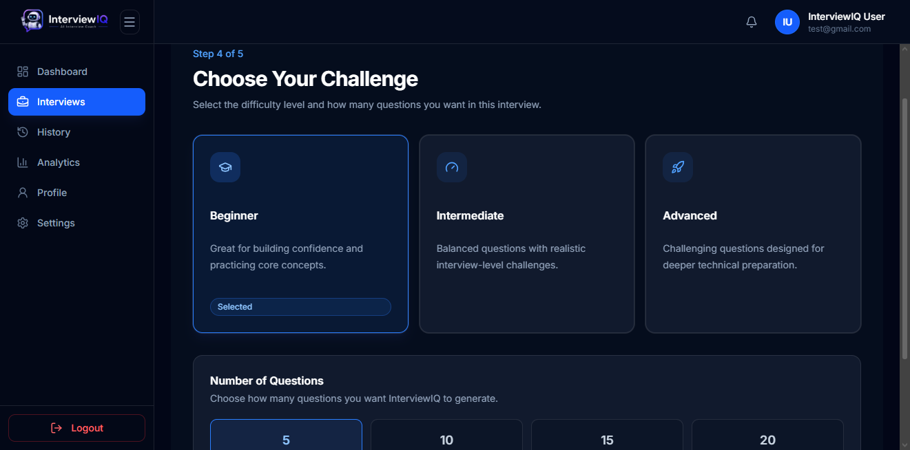
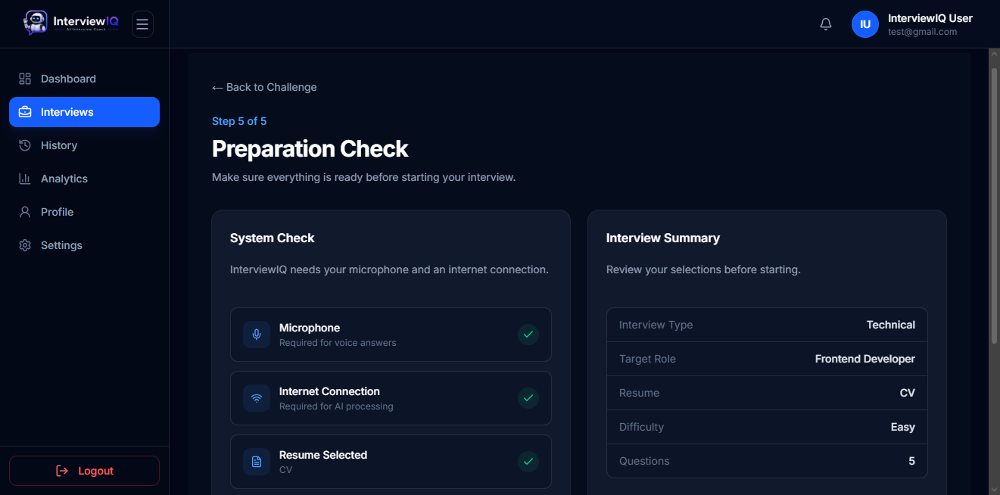
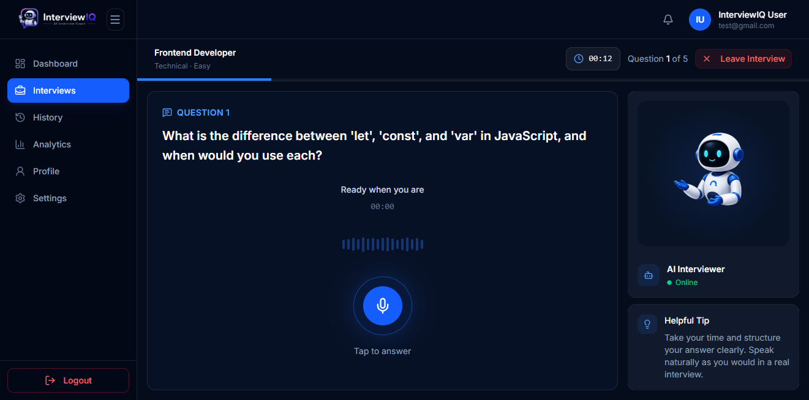
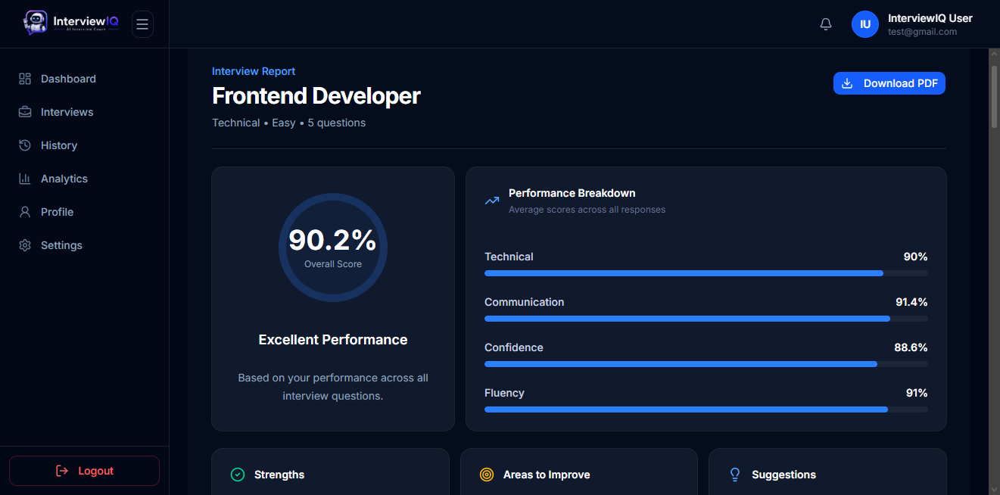

# 🎙️ InterviewIQ

**InterviewIQ** is an AI-powered mock interview platform designed to help users practice job interviews in a realistic and personalized environment.

The platform generates interview questions based on a user's resume and selected job role, allows users to answer questions using their voice, converts recorded responses into text using speech recognition, and provides detailed AI-powered feedback and performance scores.

🌐 **Live Application:**
https://interview-iq-one-lovat.vercel.app/

---

## ✨ Features

### 🔐 Authentication

- User registration and login
- Google OAuth authentication
- Password reset
- Secure JWT-based authentication
- User logout

### 👤 User Profile

- View profile information
- Update full name
- Upload and update profile avatar
- Persistent profile information

### 📄 Resume Management

- Upload PDF resumes
- Secure file storage using Supabase Storage
- Select a resume when creating an interview
- Resume text extraction
- Personally Identifiable Information (PII) sanitization
- Delete unused resumes
- Prevent deletion of resumes currently used by interviews

### 🎯 Interview Creation

Users can customize an interview by selecting:

- Resume
- Job role
- Interview type
- Difficulty level
- Number of questions

### 🤖 AI Question Generation

InterviewIQ uses **Google Gemini** to generate personalized interview questions based on:

- Candidate resume
- Job role
- Interview type
- Difficulty level

Generated questions are stored in the database so they remain available after page refreshes without needing to be regenerated.

### 🎙️ Voice-Based Interview

Users can:

- Start an interview
- View generated questions
- Record answers using a microphone
- Stop recording
- Submit recorded answers
- Continue through the interview questions

### 🗣️ Speech-to-Text

Recorded answers are processed using **OpenAI Whisper** to automatically convert speech into text.

### 🧠 AI Answer Evaluation

Interview answers are evaluated using **Google Gemini**.

Each answer receives scores for:

- Technical Accuracy
- Communication
- Confidence
- Fluency
- Overall Performance

The system also generates question-specific feedback to help users understand how they can improve their answers.

### 📊 Interview Reports

After completing an interview, users can review performance information including:

- Overall score
- Technical score
- Communication score
- Confidence score
- Fluency score
- Strengths
- Weaknesses
- Recommendations

### 📈 Interview History

Users can view previously completed interviews and review past results.

---

# 📸 Screenshots

## 🏠 Landing Page & Dashboard

| Landing Page                                                | Dashboard                                             |
| ----------------------------------------------------------- | ----------------------------------------------------- |
|  |  |

---

## 🎯 Interview Setup Flow

Creating an interview is completed through five simple steps.

| Step 1 — Select Resume                | Step 2 — Enter Job Role                |
| ------------------------------------- | -------------------------------------- |
|  |  |

| Step 3 — Select Interview Type                | Step 4 — Select Difficulty                |
| --------------------------------------------- | ----------------------------------------- |
|  |  |

### Step 5 — Select Question Count & Create Interview



---

## 🎙️ Interview Room & Report

| Interview Room                                                  | Interview Report                                                    |
| --------------------------------------------------------------- | ------------------------------------------------------------------- |
|  |  |

---

# ⚙️ How InterviewIQ Works

```text
User
  │
  ▼
Next.js Frontend
  │
  ├── Supabase Authentication
  │
  ▼
FastAPI Backend
  │
  ├── Resume Processing
  ├── Question Generation
  ├── Audio Processing
  ├── Whisper Speech-to-Text
  ├── Gemini AI Evaluation
  │
  ▼
Supabase
  ├── PostgreSQL Database
  └── Storage
```

### Interview Flow

```text
Upload Resume
      ↓
Create Interview
      ↓
Generate AI Questions
      ↓
Start Interview
      ↓
Record Voice Answer
      ↓
Whisper Transcription
      ↓
Gemini Evaluation
      ↓
Save Scores & Feedback
      ↓
Continue Through Questions
      ↓
Complete Interview
      ↓
View Interview Report
```

---

# 🛠️ Technology Stack

## Frontend

- Next.js
- React
- TypeScript
- Tailwind CSS
- shadcn/ui
- Recharts
- Lucide React

## Backend

- FastAPI
- Python
- Pydantic
- Uvicorn

## Database, Authentication & Storage

- Supabase PostgreSQL
- Supabase Authentication
- Supabase Storage

## Artificial Intelligence

- **OpenAI Whisper** — Speech-to-Text
- **Google Gemini** — Question Generation and Answer Evaluation

## Deployment

- **Frontend:** Vercel
- **Backend:** Render
- **Database:** Supabase PostgreSQL
- **Authentication:** Supabase Authentication
- **Storage:** Supabase Storage

---

# 🏗️ System Architecture

InterviewIQ follows a client-server architecture with a modular backend.

The **Next.js frontend** handles the user interface and communicates with Supabase Authentication for user registration, login, and session management.

Authenticated API requests are sent to the **FastAPI backend** using JWT access tokens.

The backend is responsible for:

- User authorization
- Resume processing
- Interview creation
- AI question generation
- Voice answer processing
- Speech transcription
- AI evaluation
- Database operations
- Report generation

Supabase is used for authentication, persistent database storage, and file storage.

For more information, see:

[System Architecture Documentation](docs/architecture.md)

---

# 🗄️ Database Structure

InterviewIQ uses six primary application tables:

```text
profiles
resumes
interviews
interview_questions
interview_responses
interview_reports
```

### `profiles`

Stores application-level user profile information.

### `resumes`

Stores resume metadata and associated storage paths.

### `interviews`

Stores interview configuration including:

- Job role
- Interview type
- Difficulty
- Question count
- Interview status

### `interview_questions`

Stores AI-generated questions for each interview.

### `interview_responses`

Stores:

- Audio storage paths
- Transcriptions
- Evaluation scores
- Question-specific feedback
- Answer duration

### `interview_reports`

Stores final aggregated interview performance results.

For detailed information about the database structure, relationships, and constraints, see:

[Database Documentation](docs/database.md)

---

# 📁 Project Structure

```text
InterviewIQ/
│
├── frontend/
│   ├── app/
│   ├── components/
│   ├── lib/
│   ├── public/
│   ├── package.json
│   └── ...
│
├── backend/
│   ├── app/
│   │   ├── core/
│   │   ├── database/
│   │   ├── exceptions/
│   │   ├── routers/
│   │   ├── schemas/
│   │   └── services/
│   │
│   ├── requirements.txt
│   └── ...
│
├── docs/
│   ├── images/
│   ├── setup.md
│   ├── architecture.md
│   ├── database.md
│   ├── api.md
│   └── deployment.md
│
├── assets/
├── README.md
└── .gitignore
```

---

# 🚀 Getting Started

## Prerequisites

Before running InterviewIQ locally, make sure the following are installed:

- Node.js
- npm
- Python 3.12+
- Git
- FFmpeg

You will also need:

- A Supabase project
- A Google Gemini API key

For complete local setup instructions, see:

[Setup Guide](docs/setup.md)

---

# 📥 Clone the Repository

```bash
git clone <YOUR_REPOSITORY_URL>
cd InterviewIQ
```

Replace `<YOUR_REPOSITORY_URL>` with the URL of your InterviewIQ GitHub repository.

---

# 💻 Frontend Setup

Navigate to the frontend directory:

```bash
cd frontend
```

Install dependencies:

```bash
npm install
```

Create a `.env.local` file.

Example:

```env
NEXT_PUBLIC_SUPABASE_URL=your_supabase_url
NEXT_PUBLIC_SUPABASE_ANON_KEY=your_supabase_anon_key

NEXT_PUBLIC_API_URL=http://127.0.0.1:8000
```

Start the development server:

```bash
npm run dev
```

The frontend should now be available at:

```text
http://localhost:3000
```

---

# 🐍 Backend Setup

Navigate to the backend directory:

```bash
cd backend
```

Create a virtual environment.

### Windows

```bash
python -m venv venv
venv\Scripts\activate
```

### Linux / macOS

```bash
python3 -m venv venv
source venv/bin/activate
```

Install dependencies:

```bash
pip install -r requirements.txt
```

Create a `.env` file containing the required backend configuration.

Example:

```env
SUPABASE_URL=your_supabase_url
SUPABASE_KEY=your_supabase_key
SUPABASE_SERVICE_ROLE_KEY=your_service_role_key

GEMINI_API_KEY=your_gemini_api_key
```

Start the FastAPI server:

```bash
uvicorn app.main:app --reload
```

The backend should now be available at:

```text
http://127.0.0.1:8000
```

> Environment variable names should always match the variables defined in the project's backend configuration.

---

# 📚 API Documentation

FastAPI automatically provides interactive API documentation when the backend is running.

### Swagger UI

```text
http://127.0.0.1:8000/docs
```

### ReDoc

```text
http://127.0.0.1:8000/redoc
```

The backend provides APIs for:

- Authentication
- User profiles
- Resume uploads
- Interview creation
- Question generation
- Interview responses
- Interview history
- Reports

For detailed endpoint documentation, see:

[API Documentation](docs/api.md)

---

# 🔒 Security & Privacy

InterviewIQ includes multiple security and privacy measures.

### Authentication

Supabase Authentication is used for user registration, login, password recovery, and Google OAuth.

The frontend sends a JWT access token with authenticated backend requests.

### Authorization

The FastAPI backend validates authenticated users and performs ownership checks before allowing access to protected resources.

Users are restricted to accessing their own:

- Profiles
- Resumes
- Interviews
- Interview questions
- Interview responses
- Reports

### Resume Privacy

Personally Identifiable Information is removed from extracted resume content before the text is used for AI processing.

This reduces unnecessary exposure of personal information when resume data is provided as context for AI question generation.

### Database Security

Supabase Row Level Security and backend ownership validation provide additional protection against unauthorized data access.

### Secret Management

Sensitive credentials such as API keys and Supabase service-role credentials are stored using environment variables and should never be committed to GitHub.

---

# 🌐 Deployment

InterviewIQ is deployed using multiple cloud platforms.

### Frontend

Hosted on **Vercel**.

🌐 https://interview-iq-one-lovat.vercel.app/

### Backend

Hosted on **Render**.

### Database

Hosted using **Supabase PostgreSQL**.

### Authentication

Handled by **Supabase Authentication**.

### Storage

Resume PDFs, profile avatars, and interview audio recordings are managed using **Supabase Storage**.

For detailed production deployment information, see:

[Deployment Guide](docs/deployment.md)

---

# 🧪 Testing

The main InterviewIQ workflow has been tested across the following areas:

### Authentication

- User registration
- Login
- Logout
- Forgot password
- Password reset
- Google OAuth

### Profile

- Open profile
- Update full name
- Upload avatar
- Verify profile persistence

### Resume Management

- Upload valid PDF
- Display uploaded resumes
- Select resume
- Resume PII sanitization
- Reject invalid/non-PDF files
- Prevent deletion of resumes in use
- Delete unused resumes

### Interview Creation

- Select resume
- Enter job role
- Select interview type
- Select difficulty
- Select question count
- Create interview
- Generate AI questions
- Verify question persistence after refresh

### Interview Room

- Start interview
- Start interview timer
- Record voice answer
- Stop recording
- Submit answer
- Whisper transcription
- Gemini evaluation
- Store scores and feedback

---

# 📖 Documentation

Additional project documentation is available in the `docs` directory:

| Document                             | Description                                     |
| ------------------------------------ | ----------------------------------------------- |
| [Setup Guide](docs/setup.md)         | Local development setup                         |
| [Architecture](docs/architecture.md) | System architecture and application flow        |
| [Database](docs/database.md)         | Database tables, relationships, and constraints |
| [API](docs/api.md)                   | Backend API overview                            |
| [Deployment](docs/deployment.md)     | Vercel, Render, and Supabase deployment         |

---

# 🔮 Future Improvements

Potential future improvements include:

- Real-time speech transcription
- AI interviewer conversations
- Video interview support
- Advanced performance analytics
- Interview recommendation system
- Additional interview categories
- Company-specific interview preparation
- Interview progress comparison
- Mobile application

---

# 👥 Contributors

InterviewIQ was developed as a **Software Engineering academic project**.

Team members contributed across areas including:

- Frontend Development
- Backend Development
- Database Development
- AI Integration
- UI/UX Design
- Testing
- Documentation

---

# 📄 License

This project was developed for educational purposes.

---

# 💡 About InterviewIQ

InterviewIQ aims to make interview preparation more practical and accessible by combining artificial intelligence, voice interaction, resume-based personalization, and detailed performance feedback in a single platform.

Instead of only reading interview questions, users can experience a more realistic interview process, practice speaking their answers, and identify areas where they can improve.
